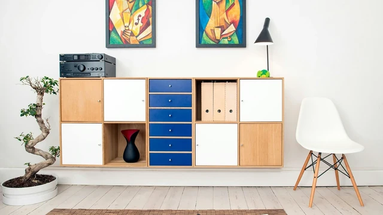

# Francis Kamau - Personal Portfolio

A modern, responsive personal portfolio website showcasing my skills, projects, and professional experience as a Product Engineer & Systems Architect.



## 🚀 Live Demo

**[https://francis-kamau.netlify.app](https://francis-kamau.netlify.app)**

## 📋 Table of Contents

- [About](#about)
- [Features](#features)
- [Tech Stack](#tech-stack)
- [File Structure](#file-structure)
- [Getting Started](#getting-started)
- [Deployment](#deployment)
- [Environment Variables](#environment-variables)
- [License](#license)

## About

This portfolio website serves as a professional showcase for Francis Kamau, featuring:
- Professional summary and background
- Technical skills and certifications
- Featured projects (BARQATA, Stawi Hub & Mwangaza AI, RentMate, etc.)
- Work experience and leadership roles
- Education and memberships
- Secure contact form with email notifications via Resend API

## ✨ Features

- **Responsive Design** - Mobile-first approach with Tailwind CSS
- **Smooth Animations** - AOS (Animate On Scroll) library integration
- **Modern UI** - Clean, professional design with gradient accents
- **Serverless Contact Form** - Netlify Functions + Resend API
- **Anti-Spam Protection** - Honeypot field, timestamp validation, origin checks
- **Icon System** - Feather Icons for consistent iconography
- **Sticky Navigation** - Easy access to all sections
- **Project Showcase** - Card-based project display with tags
- **SEO Optimized** - Meta tags, Open Graph, Twitter Cards
- **Security Headers** - XSS protection, content-type sniffing prevention

## 🛠️ Tech Stack

### Frontend
- **HTML5** - Semantic markup
- **Tailwind CSS** - Utility-first CSS framework (via CDN)
- **JavaScript (ES6+)** - Interactive functionality
- **AOS** - Scroll animations
- **Feather Icons** - SVG icon library

### Backend (Serverless)
- **Netlify Functions** - Serverless contact form handler
- **Resend API** - Email delivery service

### Development Tools
- **Netlify CLI** - Local development and deployment
- **Git** - Version control
- **VS Code** - Development environment

## 📁 File Structure

```
PersonalPortfolio/
├── .git/                          # Git repository
├── .vscode/                       # VS Code settings
├── assets/                        # Static assets
│   ├── css/
│   │   └── style.css              # Custom styles & animations
│   ├── images/
│   │   ├── barqata.jpeg           # Project images
│   │   ├── barqata1.jpg
│   │   ├── calm.webp
│   │   ├── francis-kamau.jpg      # Profile photo
│   │   ├── prison.jpeg
│   │   ├── rentmate.png
│   │   ├── stawi-hub.jpg
│   │   └── students.jpg
│   └── js/
│       ├── contact.js             # Contact form handler (Netlify Function)
│       └── script.js              # Main JavaScript (AOS, navigation)
├── netlify/                       # Netlify configuration
│   └── functions/
│       └── send-email.js          # Serverless email function
├── backend-project/               # Laravel backend (optional, not deployed)
├── index.html                     # Main portfolio page
├── netlify.toml                   # Netlify build & function config
├── package.json                   # Node.js dependencies
├── contact.php                    # DEPRECATED - Legacy PHP handler
└── README.md                      # This file
```

## 🏁 Getting Started

### Prerequisites

- Node.js 18+ (for Netlify CLI)
- npm or yarn
- A [Resend](https://resend.com) account for email functionality

### Local Development

1. **Clone the repository**
   ```bash
   git clone https://github.com/0Francis/Personal-Portfolio.git
   cd Personal-Portfolio
   ```

2. **Install dependencies**
   ```bash
   npm install
   ```

3. **Set up environment variables**
   
   Create a `.env` file in the root directory:
   ```env
   RESEND_API_KEY=re_xxxxxxxxxxxxxxxxxxxxxxxxxx
   TO_EMAIL=francis.wainaina@strathmore.edu
   ```

4. **Start local development server**
   ```bash
   npm run dev
   ```
   This runs `netlify dev` which starts a local server at `http://localhost:8888` with function support.

5. **Open in browser**
   ```
   http://localhost:8888
   ```

## 🚀 Deployment

### Deploy to Netlify

1. **Connect your GitHub repository to Netlify**
   - Go to [Netlify](https://app.netlify.com)
   - Click "Add new site" → "Import an existing project"
   - Select your GitHub repository

2. **Configure build settings**
   - Build command: (leave empty)
   - Publish directory: `.`
   - Functions directory: `netlify/functions` (auto-detected from `netlify.toml`)

3. **Set environment variables in Netlify Dashboard**
   - Go to Site settings → Environment variables
   - Add the following variables:

   | Variable | Description |
   |----------|-------------|
   | `RESEND_API_KEY` | Your Resend API key (starts with `re_`) |
   | `TO_EMAIL` | Email address to receive contact form submissions |

4. **Deploy**
   - Push to your main branch or trigger a manual deploy

### Getting a Resend API Key

1. Sign up at [resend.com](https://resend.com)
2. Go to API Keys → Create API Key
3. Copy the key (starts with `re_`)
4. Add it to Netlify environment variables

## ⚙️ Environment Variables

| Variable | Required | Description |
|----------|----------|-------------|
| `RESEND_API_KEY` | ✅ | Your Resend API key for sending emails |
| `TO_EMAIL` | ✅ | Destination email for contact form submissions |
| `RECAPTCHA_SECRET_KEY` | ✅ | Google reCAPTCHA v3 secret key |
| `URL` | Auto | Netlify sets this automatically to your site URL |

### Setting up reCAPTCHA v3

1. Go to [Google reCAPTCHA Admin](https://www.google.com/recaptcha/admin)
2. Register a new site with reCAPTCHA v3
3. Add your domains (e.g., `francis-kamau.netlify.app`, `localhost`)
4. Copy the **Site Key** and update it in:
   - `index.html` (line with `recaptcha/api.js?render=`)
   - `assets/js/contact.js` (line with `RECAPTCHA_SITE_KEY`)
5. Copy the **Secret Key** and add it to Netlify environment variables as `RECAPTCHA_SECRET_KEY`

## 🔒 Security Features

- **reCAPTCHA v3** - Invisible bot detection with score-based verification
- **Rate Limiting** - Max 3 emails per hour per email address
- **Honeypot Field** - Hidden field that catches bot submissions
- **Timestamp Validation** - Rejects forms submitted in < 3 seconds
- **Origin Check** - Validates requests come from your domain
- **Input Sanitization** - Comprehensive XSS prevention
- **HTML Escaping** - All user input escaped before display
- **Security Headers** - X-Frame-Options, X-Content-Type-Options, etc.

## 🎨 Customization

### Updating Content

- Edit `index.html` to update personal information, projects, and experience
- Replace images in `assets/images/` with your own
- Update profile photo at `assets/images/francis-kamau.jpg`

### Styling

- Modify `assets/css/style.css` for custom styles
- Tailwind classes can be adjusted directly in `index.html`
- Gradient colors defined in `.gradient-text` class

### Adding Projects

Add new project cards in the Projects section of `index.html`:
```html
<div class="project-card bg-white rounded-lg overflow-hidden shadow-md border border-gray-100">
    
    <div class="p-6">
        <h3 class="text-xl font-semibold text-gray-800">Project Name</h3>
        <p class="text-gray-600 mb-4">Project description...</p>
        <!-- Tags and date -->
    </div>
</div>
```

## 📱 Responsive Breakpoints

- **Mobile**: < 768px
- **Tablet**: 768px - 1024px
- **Desktop**: > 1024px

## 🔗 External Dependencies (CDN)

- [Tailwind CSS](https://tailwindcss.com/) - `cdn.tailwindcss.com`
- [AOS](https://michalsnik.github.io/aos/) - `unpkg.com/aos@2.3.1`
- [Feather Icons](https://feathericons.com/) - `cdn.jsdelivr.net/npm/feather-icons`

## 👤 Author

**Francis Wainaina Kamau**

- Email: francis.wainaina@strathmore.edu
- LinkedIn: [Francis Wainaina](https://www.linkedin.com/in/francis-wainaina-188550304)
- GitHub: [@0Francis](https://github.com/0Francis)
- Phone: +254 768 411 928

## 📄 License

This project is open source and available under the [MIT License](LICENSE).

---

© 2024 Francis Kamau. All rights reserved.
